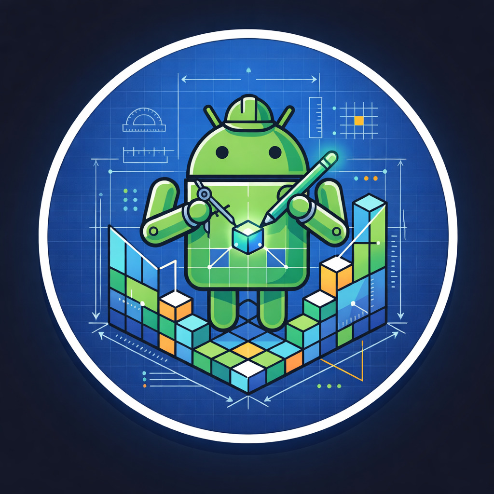

<div align="center">



# Android Image Architect

**Desmonte, analise e extraia componentes de firmwares Android com precisão cirúrgica.**

[](LICENSE)
[](https://python.org)
[](https://electronjs.org)
[](https://nodejs.org)
[]()

</div>

---

## O que é o AIA?

O **Android Image Architect** é uma ferramenta desktop voltada para engenharia reversa de firmwares Android. Com uma interface moderna e intuitiva, ele simplifica tarefas que antes exigiam múltiplos scripts e conhecimento avançado de linha de comando — como extrair kernels, ramdisks, partições lógicas e inspecionar metadados AVB — tudo em um só lugar.

---

## Recursos

### Boot & Recovery
- Extração de **Kernel**, **Ramdisk** e **DTB**
- Suporte a `boot.img`, `recovery.img`
- Compatível com Android Boot Image **v2, v3 e v4**

### Super Image
- Suporte a `super.img` e **chunks** (`super.img_sparsechunk.X`)
- União automática de chunks antes da extração
- Conversão **sparse ↔ raw**
- Extração de partições lógicas: `system`, `vendor`, `product`, `odm`, `system_ext`, entre outras

### Sistemas de Arquivos
- Extração de **EXT4** — via Python puro ou 7-Zip
- Extração de **EROFS** — via 7-Zip

### DTBO
- Extração automática de múltiplos `.dtb` a partir de `dtbo.img`

### VBMeta
- Inspeção detalhada de `vbmeta.img`:
  - Flags AVB
  - Algoritmo de assinatura
  - Cabeçalhos e metadados completos

### Interface
- Tema escuro moderno
- Console em tempo real com logs detalhados
- Barras de progresso por operação
- Layout responsivo e navegação por abas

---

## Requisitos

| Componente       | Mínimo   | Recomendado |
|------------------|----------|-------------|
| Python           | 3.8+     | 3.11+       |
| Node.js          | 18+      | 20+         |
| Sistema          | Windows 10 / Linux | Windows 11 |
| 7-Zip            | —        | Recomendado |

> **Windows:** Durante a instalação do Python, marque a opção **"Add Python to PATH"**.

---

## Instalação

### Executável (Recomendado)

| Plataforma | Download |
|------------|----------|
| 🪟 Windows | [**Baixar para Windows**](https://drive.google.com/file/d/1AeqL-luHDRQae4-5c345gXxB3-ZtLUkM/view?usp=sharing) |

1. Baixe o instalador pelo link acima
2. Execute o instalador e abra o AIA
3. Se necessário, aponte o caminho do `python.exe` nas configurações

### A partir do código-fonte

```bash
# 1. Clone o repositório
git clone https://github.com/seu-usuario/android-image-architect.git
cd android-image-architect

# 2. Inicialize o projeto (caso package.json não exista)
npm init -y

# 3. Instale as dependências do Electron
npm install --save-dev electron@^28.0.0 electron-builder@^24.0.0
npm install electron-store@^8.1.0

# 4. (Opcional, mas recomendado) Instale o suporte a EXT4
pip install ext4

# 5. Inicie em modo desenvolvimento
npm start
```

#### Build

```bash
npm run build
```

Os executáveis serão gerados na pasta `dist/`.

#### Referência rápida de comandos

| Comando | Descrição |
|---------|-----------|
| `npm init -y` | Inicializa o projeto com `package.json` padrão |
| `npm install --save-dev electron@^28.0.0 electron-builder@^24.0.0` | Instala Electron e o builder |
| `npm install electron-store@^8.1.0` | Instala persistência de configurações |
| `pip install ext4` | Suporte a extração EXT4 (opcional) |
| `npm start` | Inicia em modo desenvolvimento |
| `npm run build` | Gera os executáveis na pasta `dist/` |

---

## Como usar

### Boot / Recovery

1. Vá para a aba **Boot/Recovery**
2. Clique em **Abrir boot.img** e selecione o arquivo
3. Clique em **Desempacotar**

O AIA extrai automaticamente: Kernel, Ramdisk, DTB e todas as informações do cabeçalho.

---

### Super Image

**Com chunks:**
1. Selecione a pasta contendo `super.img_sparsechunk.0`, `.1`, `.2`...
2. Clique em **Desempacotar**

**Arquivo único:**
1. Abra o `super.img` diretamente
2. Clique em **Desempacotar**

O AIA une os chunks, converte o formato e extrai todas as partições automaticamente.

---

### DTBO

1. Selecione o arquivo `dtbo.img`
2. Clique em **Desempacotar DTs**

Todos os `.dtb` serão extraídos individualmente.

---

### VBMeta

1. Selecione o arquivo `vbmeta.img`
2. Clique em **Inspecionar**

Todas as informações AVB serão exibidas no console.

---

## Estrutura do projeto

```
android-image-architect/
├── main.js
├── preload.js
├── aia-ui.html
├── package.json
├── assets/
├── tools/
├── dist/
└── python/
    ├── extract_boot.py
    ├── extract_super_chunks.py
    ├── extract_fs.py
    ├── extract_dtbo.py
    ├── inspect_vbmeta.py
    └── utils.py
```

---

## Contribuindo

Contribuições são muito bem-vindas. Você pode ajudar de várias formas:

- **Reportar bugs** — Abra uma issue descrevendo o problema, o firmware utilizado e o log de erro
- **Sugerir melhorias** — Novos formatos, novos recursos, melhorias de UX
- **Enviar Pull Requests** — Antes de submeter, verifique se os fluxos principais (Boot, Super e DTBO) continuam funcionando corretamente

---

## Aviso legal

Esta ferramenta foi desenvolvida para fins educacionais, engenharia reversa legítima e manutenção de dispositivos próprios. O uso indevido é de responsabilidade exclusiva do usuário.

---

## Licença

Distribuído sob a licença [MIT](LICENSE). Sinta-se livre para usar, modificar e distribuir.

---

<div align="center">

Feito com ❤️ para a comunidade Android

</div>
